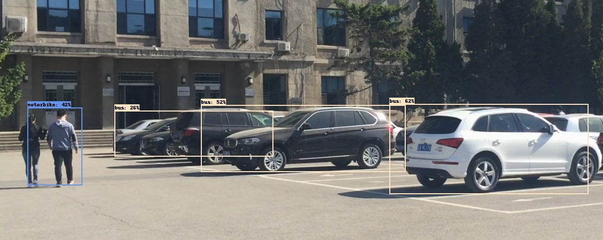
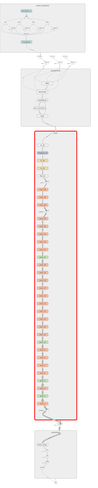

# YOLOv1-Tensorflow  
## 运行环境： 
Python3 + Tensorflow1.5 + OpenCV-python3.3.1 + Numpy1.13 
windows和ubuntu环境都可以  
## 准备工作： 
请在[yolo1检测模型](https://drive.google.com/file/d/0B5aC8pI-akZUNVFZMmhmcVRpbTA/view?usp=sharing)下载训练好的模型YOLO_small.ckpt，并放到同一文件夹下  
## 文件说明： 
1、YOLO_V1_Inference.py：程序文件，测试图片 
2、YOLO_V1_export_interface_graph.py：程序文件，测试图片，并生成相应pb文件 
3、boxes.txt：检测结果的类别和边界框坐标  
### 运行YOLO_V1_Inference.py即可得到效果图： 
1、car.PNG：输入的待检测图片  
 
2、detected_image.jpg：检测结果可视化  
 

3、YOLOV1_graph.png：the Graph for YOLO_V1 from tensorboard
 
